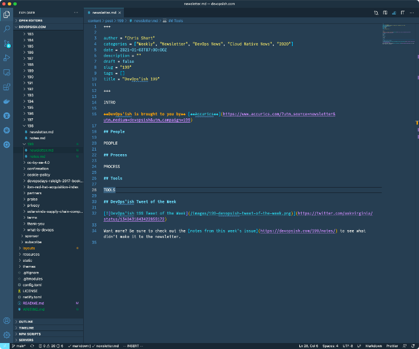

- [DevOps'ish Writing Process](#devopsish-writing-process)
  - [Guiding Principles](#guiding-principles)
    - [5-5-10 Guideline](#5-5-10-guideline)
    - [Work work](#work-work)
    - [Choosing content for the newsletter](#choosing-content-for-the-newsletter)
    - [Prohibitions](#prohibitions)
      - [No Medium, No Substack](#no-medium-no-substack)
      - [Trash talking](#trash-talking)
  - [Sections](#sections)
    - [Intro](#intro)
    - [People](#people)
    - [Process](#process)
    - [Tools](#tools)
    - [DevOps'ish Tweet of the Week](#devopsish-tweet-of-the-week)
  - [Building the web version of the newsletter](#building-the-web-version-of-the-newsletter)
  - [Building the email version of the newsletter](#building-the-email-version-of-the-newsletter)
  - [Publishing the web version of the newsletter](#publishing-the-web-version-of-the-newsletter)

# DevOps'ish Writing Process

This document aims to provide a checklist of all activities necessary to publish an issue of [DevOps'ish](https://devopsish.com). This is a living document and a perpetual work in progress.

## Guiding Principles

The foundation of DevOps is People, Process, and Tools, in that order of importance. The newsletter is broken up into those three sections to allow folks from all walks of life to appreciate the newsletter more.

Generally, the newsletter goes live at 0700 UTC on Sundays. There can be exceptions to this because of life getting in the way.

### 5-5-10 Guideline

The 5-5-10 Guideline exists to keep the newsletter more readable and, more importantly, the writer sane. It's a simple guideline of keeping the People and Process sections to five links each and the Tools section to ten links (minus any ads). While this is sometimes broken it's best to follow it and link to the notes.md file as appropriate more often (linking to the notes file).

The People and Process sections are far more important than the tools section but, the readership over the years appreciates the Tools section much more. While this flies in the face of [What DevOps Is](https://devopsish.com/what-is-devops/), the goal is to grow the newsletter by making folks happy. People (myself included) love to discover new tools to help them be more productive. So it's a win-win.

### Work work

Keeping links to employers' sites to a minimum is considered healthy. However, it's safe to link to works the newsletter writer created, but, in general, try to find a similar story from a source other than your employer to maintain impartiality and authenticity. Plus, you're not writing a newsletter for your job; this is for you!

### Choosing content for the newsletter

I asked Corey Quinn once about including a potentially controversial piece of content from the world of tech. Corey asked me, "What's does that have to do with DevOps?" It had nothing to do with any of the topics covered in the newsletter. Here are the top five topics the newsletter covers as found on the [tags page of the site](https://devopsish.com/tags/):

- DevOps
- Open Source Software
- Cloud Native topics
- Kubernetes specifically
- Cloud

### Prohibitions

#### No Medium, No Substack

I have a hard standing rule not to publish content from medium.com or substack.com (see [nomedium.dev](https://nomedium.dev)). The authenticity, accessibility, correctness, and page load speed are all problems on these sites. Additionally, Medium provides a terrible experience for readers.

There are some exceptions here. Some brands are using Medium as a CMS only. The [Netflix Engineering blog](https://netflixtechblog.com/) is one such example. They are using Medium as a platform only, are bringing their domains, and not monetizing the content in any way. These are safer to link to, but the No Medium rule is best adhered to as often as possible.

#### Trash talking

"Sunlight is the best disinfectant" —Louis Brandeis  
"Don't punch down." —Corey Quinn

It's pertinent to get down in the mud from time to time and shine a light on bad things. But, there is an inherent risk to both self and others when doing so.

DO NOT trash talk competitors, brands, or other companies unless the topic itself is about bad behavior or ill will towards the DevOps'ish readership, the planet, or others in the open source software or cloud native ecosystems.

One purpose of DevOps'ish is to make sure folks know about toxic organizations or people when that information becomes available and is verifiable. Remember, this exposes the writer and sources to inherit risk. Be ready for blowback.

## Sections

As discussed, the newsletter is broken into sections to help organize it and keep it more readable. These sections all have their unique guiding principles.

### Intro

The intro is a free form space that can discuss multiple topics or individual ones of significant importance. At the very least, it should discuss what's in the newsletter. But, more preferably, it should be an original work that adds more value to the reader. The intro is also the place to connect with the reader, a critical component in newsletter writing.

### People

In general, if a story discusses managing, helping, or mentoring people, it goes in the People section. Also, suppose an article discusses a person specifically, a person's experience, or in some cases, a single person as the source of a news story. In that case, it belongs in the People section.

### Process

In general, articles discussing high-level principles or guides to doing something belong in the Process section. Additionally, security is a process, so pieces about breaches or security can land in the Process section as well.

### Tools

Stories talking about tools used in environments across the globe belong in the Tools section. Links to GitHub repos belong at the bottom of this list. As a rule of thumb, if it doesn't belong in People or Process, it probably belongs in Tools.

### DevOps'ish Tweet of the Week

The Tweet of the Week is a unique part of DevOps'ish. When finding funny, informative, or thought-provoking tweets (or threads), add them to Pocket throughout the week. At writing time, pull them into the notes.md file while building the newsletter. It's good to have a few to choose from, so keep that in mind throughout the week.

After years of running the newsletter, it is apparent that people will make their accounts temporarily private, purge tweets of a certain age, or the Twitter API (much worse) is down at build time. Using the Hugo shortcode `tweet` to embed tweets is what had been done historically. But, as folks change their minds about what tweets are available to the public, the build will ultimately break, and that sucks.

Fixing this "lost tweet" problem usually involves going to the live site and capturing the text version of the tweet that the Hugo shortcode embeds as a screenshot and save that in the site's repo.

## Building the web version of the newsletter

Using your IDE of choice...

1. Read the news throughout the week: I use a combination of [Inoreader](https://www.inoreader.com/) (newsreader), [Twitter](https://twitter.com/ChrisShort), the [DevOps'ish Telegram](https://t.me/devopsish), and many more sources to save the week's news to [Pocket](https://getpocket.com/).
1. Scaffold the week's newsletter: Create a git branch titled as issue number, copy/pasta previous week's issue, replace instances of date and issue number as appropriate (use Find in Folder in VSCode to make this painless). Also, be sure to clear out the old content (add placeholders for the three main content blocks and the intro, as needed).

1. Add Ads: ***This point is critical.*** Check the [DevOps'ish Ad Calendar](https://calendar.google.com/calendar/embed?src=chrisshort.net_566j882ba29v52rsv35ac3bufs%40group.calendar.google.com&ctz=America%2FDetroit) and place ad copy from the sponsors into the appropriate sections of newsletter.md based on the ad's copy. Ad copy and format is defined by the [DevOps'ish Sponsor](https://devopsish.com/sponsor/) guidelines.
1. Create notes.md: Open a new browser window, go to Pocket, and begin the process of finding eligible articles related to topics covered in DevOps'ish. Open all the stories in a new window and use the TabCopy extension to pull all the tabs into the notes.md file as Markdown links. Highlight the selection of recently pasted links and do a s/$/\n/g so the notes.md file is more readable.
1. DevOps'ish Tweet of the Week: This should be embedded using the Hugo `tweet` shortcode. Then screenshot the rendered tweet in preview. Optimize the screenshot using a service like [ShortPixel](https://shortpixel.com/online-image-compression) (online) or [ImageOptim](https://imageoptim.com/) (offline). Remove the shortcode version of the tweet and embed the screenshot of it, and link to it accordingly. **It is vitally important** that the tweet is committed to the main branch before the newsletter gets sent or published. This allows you to use the web and not some services rendering and embedding images (which you have little to no control over). Trust me.
1. Use the --Force-- analytics, Luke: Use [Twitter Analytics](https://analytics.twitter.com/user/ChrisShort/home), [/r/devopsish](https://www.reddit.com/r/devopsish/), [LinkedIn](https://www.linkedin.com/in/thechrisshort), [Buffer](https://buffer.com/), and, most importantly, your gut to find "must discuss" topics for the newsletter. Cut those links from notes.md into the appropriate section of the newsletter.md file.
1. Write the damn thing: As you cut links from notes.md into the main newsletter.md file be sure to add a thought to each one. The link should be on its own line followed by a line break. A quote from the article is a bare minimum, but it's always best to add your spin to the linked article.
1. Create a Pull Request (PR): Netlify is setup to render pull requests as preview pages automatically. This gives you a usable URL to analyze the newsletter, share rough drafts with others, or anything else needed in the writing process. When you've created your PR head over to the Netlify Builds page to see how things are going and to get the preview link itself.
1. Find the tags: Use a keyword density analysis tool ([like this one](https://www.webconfs.com/seo-tools/keyword-density-checker/)) to determine which keywords should be used as tags in the issue. The more tags, the merrier. If a tag has never been used before, see if previous issues could have the tag added (this process is laborious and should be done outside of the newsletter writing process but is sometimes necessary to establish authority). For example, I wrote about Docker a lot before because I was a happy consumer before I wrote Docker is Dead. I feel like this is why Docker is Dead exploded when it was published.
1. Write the description: using the newsletter itself, ads, tags, and any other thoughts, create a description for use on the subject line and the meta description tag.

## Building the email version of the newsletter

Once you've built out the web version of the newsletter in your IDE and are almost ready to publish, proceed with the following...

1. Ensure the DevOps'ish Tweet of the Week is committed to main and accessible via the production URL.
1. Use the issue number and description as the subject (testing shows putting the description in the subject improves open rates).
1. Use the previous week's newsletter as a template for this week's newsletter
1. Using the Hugo live render and View Source in your browser, copy the relevant HTML blocks into the appropriate newsletter section. Be sure that spacing and so forth look good through the use of `
&nbsp;
` to add blank lines where appropriate.
1. Make sure you are proofreading as you go as you're in the browser tools like [Grammarly](https://grammarly.com/) and [Hemingway Editor](http://www.hemingwayapp.com/) are vitally important at typo and grammar correction. Be sure to make those corrections to the web issue in your IDE as well. You could also do this as a separate step entirely (for more extended intros, it's best to write them then run them through the tools for corrections sooner rather than later).
1. The DevOps'ish Tweet of the Week should link to the devopsish.com URL for the screenshot. It should link to the tweet directly. The alt tag for the image should be the contents of the tweet itself (minus pictures).
1. Make sure you send the newsletter to the correct mailing list and schedule it to send at 0700 UTC on Sunday.

## Publishing the web version of the newsletter

After you built and scheduled the newsletter, come back to the article's web version (making sure to fix grammar and other mistakes discovered in the email version during the previous steps). You're ready to ship the final changes and merge the PR.

1. Commit all changes and edits to the issue's branch.
1. Go to the previously generated PR and make sure everything is good to go
1. Hit Squash and Merge, and the entire process is complete.
